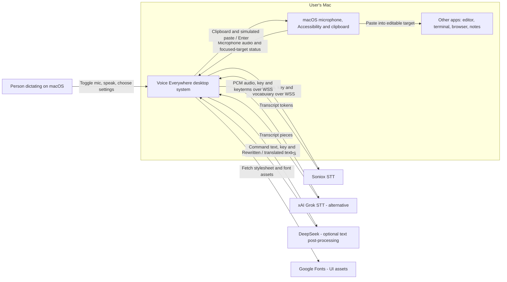
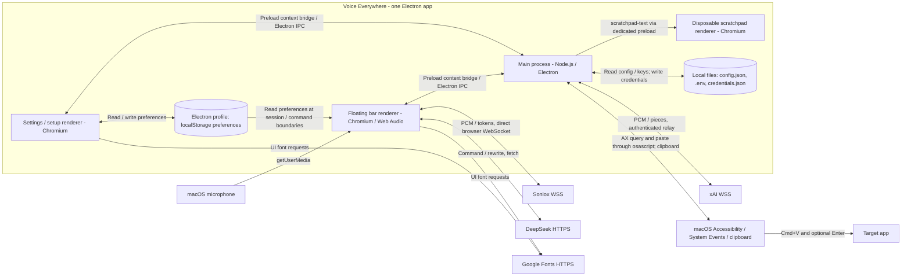

# Voice Everywhere

Global voice input for macOS. Speak anywhere, insert text at your cursor — in any app.


## Install

```bash
git clone https://github.com/hungson175/voice-everywhere.git && cd voice-everywhere && bash install.sh
```

## What It Does

1. **Speak** — Click the mic button or press `Ctrl+Option+Cmd+V`
2. **Transcribe** — Real-time speech-to-text via Soniox (default) or Grok
3. **Translate (optional)** — DeepSeek translates to English or Vietnamese after the stop word, with optional Clean Mode rewriting
4. **Insert** — Say “thank you” to finish a command. Text is pasted into a confirmed editable target, or opened in a disposable scratchpad if the target is non-editable, missing, or still uncertain after one retry

Works with VS Code, Terminal, browsers, Notes, Slack, and any app that accepts text input.

## Requirements

- macOS (Apple Silicon or Intel)
- Node.js
- [Soniox API key](https://soniox.com/) — for speech-to-text
- macOS Microphone and Accessibility permissions — for capture and text insertion
- Optional DeepSeek key for translation / Clean Mode; optional xAI key for Grok STT

## Features

- **System-wide text insertion** — Clipboard paste + AppleScript, works in any app
- **Disposable draft fallback** — Opens an in-app scratchpad that closes without saving or creating a file
- **Enter Mode** — Optionally sends Enter after pasting (for chat inputs, terminals)
- **Live transcript** — See real-time speech-to-text as you speak
- **Switchable STT** — Soniox by default, or Grok Voice Transcribe 2.0
- **Post-transcription translation / Clean Mode** — Optional DeepSeek translation and fluency rewriting; failures retain the raw command
- **Voice-input marker** — Appends “— voice input, be careful with typos” to each command
- **Global shortcut** — `Ctrl+Option+Cmd+V` to toggle mic from anywhere
- **Audio feedback** — Reminder beep every 60s while listening, confirmation beep on insert
- **Menubar tray icon** — White circle (idle) / red circle (recording)
- **Configurable vocabulary** — Custom terms and phonetic corrections for technical jargon

## Setup

Open the tray settings and enter your Soniox API key (the setup gate still requires Soniox even if you later select Grok). It is stored in plain JSON in the app's macOS user-data directory. An optional DeepSeek key can also be saved in settings.

For per-install keys, use a private, git-ignored project `.env` with `DEEPSEEK_VOICE_API_KEY` and/or `XAI_API_KEY`. Never commit its contents. The packaged build copies `.env` into app resources; protect the installed bundle and do not distribute a key-bearing build. Select the speech engine and output language in Settings. Clean Mode defaults off; Enter Mode defaults on. Review these settings before dictating into terminals or chat inputs.

## Dev Mode

```bash
npm install
npm start
npm test    # unit tests, no live providers
```

`npm run e2e` launches the real Electron app with fake microphone audio and live providers; it requires keys/network and is not an offline test.

For a manual macOS directory build, use `CSC_IDENTITY_AUTO_DISCOVERY=false npx electron-builder --mac --dir` to avoid code-signing discovery hangs. The current `install.sh` expects `dist/mac-arm64`, so its automatic installation path targets Apple Silicon; Intel packaging/installation needs an appropriate build path.

## Tech Stack

- **Electron** — Tray + BrowserWindow
- **Soniox / Grok** — Real-time WebSocket STT (`stt-rt-v5` / `grok-voice-transcribe-2.0`)
- **DeepSeek** — Optional HTTP post-processing (configured default `deepseek-v4-flash`)
- **Web Audio API** — Microphone capture in renderer
- **AppleScript** — System-level text insertion via clipboard paste

## Architecture — C4 levels 1–3

These views describe the implementation at upstream commit `f528680` (2026-10-05), not a proposed design. “Container” means a runtime or data-store boundary, not Docker. All internal runtimes ship in one Electron desktop app; there is no separately deployed backend. Level 4 (Code) is intentionally omitted. Provider names/models below are source configuration, not a claim of currently verified service availability.

### Level 1 — System Context



The product boundary is Voice Everywhere, including its disposable scratchpad; target apps and macOS services are external integrations. It does not inspect terminal contents or provide terminal selection. Only the selected STT engine receives audio. DeepSeek receives text only when Clean Mode is on or an explicit output language is selected. Google Fonts is a separate UI network dependency, not part of transcription.

### Level 2 — Containers



| Container / store | Responsibility and source |
|---|---|
| Main process | Owns tray, shortcut, windows, permission checks, IPC handlers, local keys, Grok relay and OS insertion. [electron/main.js](electron/main.js) |
| Floating bar renderer | Non-focusable recording UI; owns mic capture, live transcript, command detection, optional rewriting, insertion requests and feedback. [ui/bar.html](ui/bar.html), [ui/bar-renderer.js](ui/bar-renderer.js) |
| Settings / setup renderer | Collects credentials via IPC and persists engine, language, Enter Mode, Clean Mode and vocabulary preferences in localStorage. [ui/renderer.js](ui/renderer.js), [ui/setup.js](ui/setup.js) |
| Scratchpad renderer | Receives draft updates through a narrower bridge; edits a textarea in memory, with caret-aware updates when already focused. Closing destroys the draft, without a save/file operation. [ui/scratchpad.js](ui/scratchpad.js), [ui/scratchpad-model.js](ui/scratchpad-model.js) |
| Local files | [config.json](config.json) supplies Soniox/audio/stop-word defaults. Development `.env` and config come from the project root; packaged copies come from resources. `credentials.json` resides in Electron `userData`. [electron/env-loader.js](electron/env-loader.js), [electron/credentials.js](electron/credentials.js) |
| Electron profile | localStorage persists preferences shared by settings and bar; it is not a transcript database. |

**Credential / data boundary:** `credentials.json` stores Soniox and optionally DeepSeek keys as plaintext, not Keychain-encrypted secrets. Soniox has no `.env` fallback in the stored-key loader. At startup, `.env`'s `DEEPSEEK_VOICE_API_KEY` takes precedence over the stored DeepSeek key; a settings save can update the active key. Soniox and DeepSeek keys cross the preload bridge to renderer code for direct requests. `XAI_API_KEY` stays in main and is never exposed through the renderer bridge. Windows use `contextIsolation: true` and `nodeIntegration: false`; these are process boundaries, not a guarantee against same-user file access. There is no application transcript persistence in this pipeline, but text can remain in the OS clipboard, target app or open scratchpad. Provider-side retention is outside this code's control and is not verified here.

### Level 3 — Components

This view expands the two pipeline-owning containers. Settings and scratchpad remain supporting containers rather than introducing a class-level view.

```mermaid
flowchart TB
  soniox["Soniox service"]
  xai["xAI service"]
  ds["DeepSeek service"]
  os["macOS AX / clipboard / System Events"]
  store[("Config and key files")]
  settings["Settings / setup renderer"]
  scratch["Scratchpad renderer"]
  subgraph bar["Floating bar renderer"]
    controller["Bar controller and UI state machine"]
    lifecycle["Audio lifecycle and reconnect policy"]
    capture["Shared mic capture / PCM streaming"]
    son["Soniox adapter / token accumulation"]
    grok["Grok IPC socket / piece accumulation"]
    stop["Stop-word detector"]
    clean["Optional text post-processor"]
    marker["Voice-input marker"]
  end
  subgraph main["Electron main process"]
    bridge["Preload bridges and IPC handlers"]
    host["App / window / tray host"]
    keys["Config and credential loader"]
    relay["Authenticated Grok relay"]
    insert["AX-aware text inserter"]
    draft["Scratchpad lifecycle / update dispatch"]
  end
  host -->|"toggle-mic event"| bridge
  bridge -->|"Toggle"| controller
  controller <-->|"Timers, generations, retry decisions"| lifecycle
  controller -->|"Start / stop selected engine"| capture
  capture -->|"16-bit mono PCM at 16 kHz"| son
  capture -->|"Same PCM capture contract"| grok
  son <-->|"Browser WebSocket"| soniox
  grok <-->|"Session IPC and transcript events"| bridge
  bridge <-->|"grok-open / audio / close / event"| relay
  relay <-->|"Bearer-authenticated WebSocket"| xai
  son -->|"Interim / final transcript callback"| controller
  grok -->|"Interim / final transcript callback"| controller
  controller -->|"Final transcript"| stop
  stop -->|"Command without stop word"| controller
  controller -->|"Command and output settings"| clean
  clean <-->|"HTTPS chat completions when enabled"| ds
  clean -->|"Processed text or raw fallback"| marker
  controller -->|"Raw command if processing disabled"| marker
  marker -->|"Text plus voice-input note"| bridge
  settings <-->|"Settings / credentials IPC"| bridge
  bridge <-->|"Config / key retrieval or credential save"| keys
  keys <-->|"Local file IO"| store
  bridge -->|"insert-text with enterMode"| insert
  insert <-->|"AX check, text clipboard, Cmd+V / Enter"| os
  insert -->|"Non-editable, no focus, or unknown after retry"| draft
  draft -->|"Create window and dispatch scratchpad-text"| scratch
```



| Component | Responsibilities / interfaces |
|---|---|
| Bar controller | [ui/bar-renderer.js](ui/bar-renderer.js) orchestrates engine choice, waveform, transcript callbacks, stop-word commands and feedback. Generation checks prevent cancelled async work from initiating a later paste. |
| Audio / retry guards | [ui/audio-lifecycle.js](ui/audio-lifecycle.js) manages single waveform loop, named timers, shared feedback audio and generations. [ui/reconnect-policy.js](ui/reconnect-policy.js) retries transient drops at 1/2/4/8/16 seconds, then stops; definite key/mic refusals do not retry. Mic resources are released between attempts; LISTENING requires a live engine. |
| Shared capture + Soniox adapter | [ui/stt.js](ui/stt.js) uses `getUserMedia`, Web Audio and signed 16-bit PCM. Soniox sends an initial JSON config followed by binary audio, accumulates final/interim tokens and strips endpoint markers. Endpoint detection is enabled in config. The adapter retains native-translation support, but the current bar starts it in transcription-only mode. |
| Grok renderer adapter | [ui/grok-stt.js](ui/grok-stt.js) adapts relay IPC to the shared socket contract. [ui/grok-transcript.js](ui/grok-transcript.js) joins final pieces without duplicating whole-turn recaps. |
| Stop-word detector | [ui/stopword.js](ui/stopword.js) extracts commands from final transcript on configured “thank you”; interim text remains display-only. |
| Text post-processor / marker | [ui/clean-mode.js](ui/clean-mode.js) performs translation plus cleanup for an explicit output language, or cleanup for Clean Mode. Default endpoint/model are `https://api.deepseek.com/chat/completions` / `deepseek-v4-flash`, overridable via localStorage. An 8-second default timeout, absent key or request failure returns control to raw-text fallback. [ui/voice-note.js](ui/voice-note.js) appends the voice-input warning after processing. |
| IPC / host | [electron/preload.js](electron/preload.js) exposes the renderer API; [electron/main.js](electron/main.js) handles it and owns shortcut, tray, permissions and windows. [electron/bar-position.js](electron/bar-position.js) follows the cursor display's work area; [electron/bar-visibility.js](electron/bar-visibility.js) preserves the bar's Spaces behavior without stealing focus. |
| Grok relay | [electron/grok-relay.js](electron/grok-relay.js) owns session sockets, keeps xAI auth in main, waits for `transcript.created` before accepting audio, and closes sessions on bar reload / app quit. A failed handshake can trigger an authenticated `/v1/models` check to classify key rejection. |
| Text inserter / scratchpad dispatch | [electron/text-inserter.js](electron/text-inserter.js) checks the focused AX element, retries uncertainty once, and pastes only into confirmed editable targets. It restores the previous **text** clipboard after successful paste, not all rich clipboard formats. Enter Mode applies only there. Other targets open the scratchpad and retain transcript text on the clipboard; insertion exceptions also preserve clipboard text. Permission denial is reported before insertion. [electron/scratchpad-preload.js](electron/scratchpad-preload.js) exposes only draft updates to the scratchpad. |

**End-to-end flow:** shortcut → capture → selected STT → final transcript → stop-word extraction → optional DeepSeek processing (or raw fallback) → voice-input marker → `insert-text` IPC → confirmed-target paste or disposable draft. Neither sibling project is a runtime dependency.

## License

MIT
